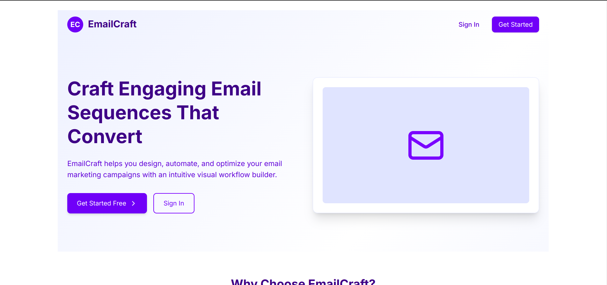
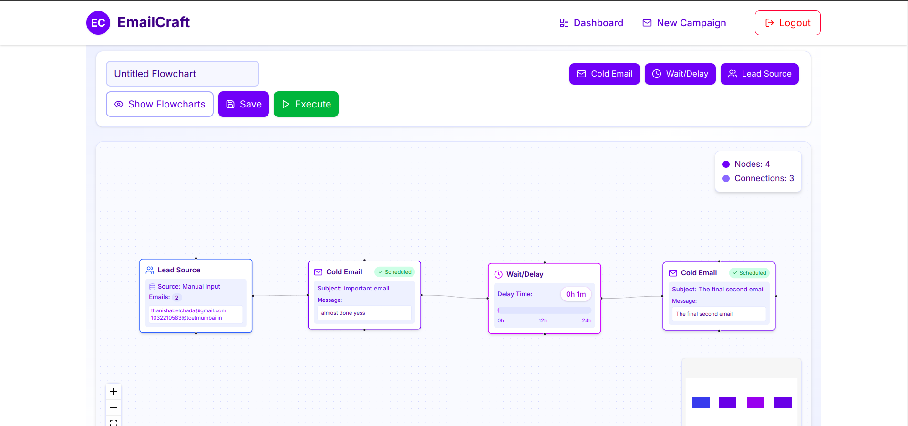
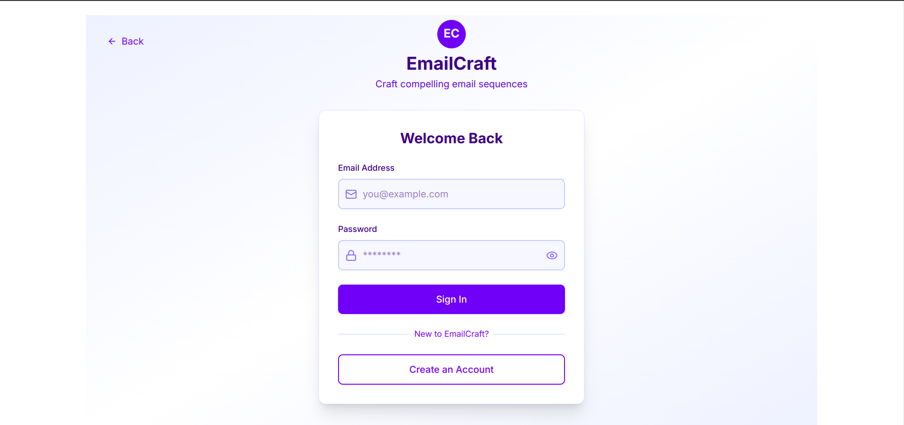
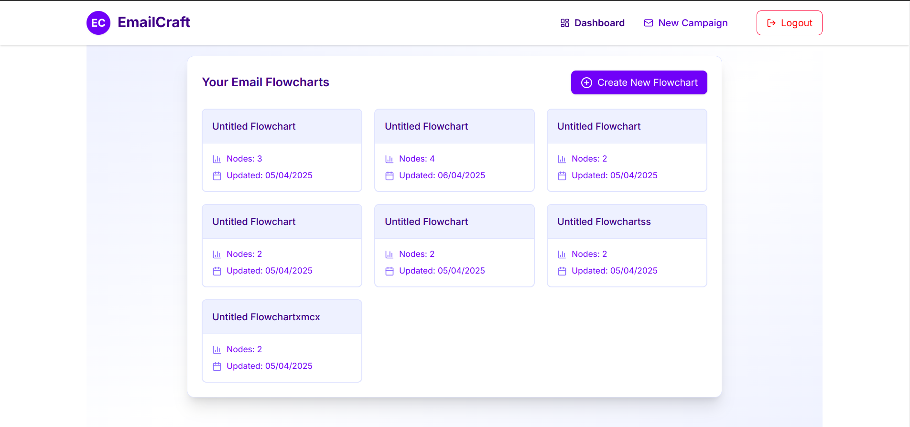

<h1 align="center">EmailCraft - Email Marketing Automation Platform</h1>

<div align="center" style="display: flex; flex-wrap: wrap; justify-content: center; gap: 40px; margin: 20px 0;">
  
  
  
  
</div>

<div align="center">
EmailCraft is a visual email marketing automation platform that allows users to create, manage, and execute email campaigns through an intuitive flowchart interface.
<br><br>
<div align="left">

- User Authentication: Register, login, and secure access
- Visual Flowchart Editor: Create email sequences with a - drag-and-drop interface
- Email Scheduling: Schedule emails to be sent at specific intervals
- Lead Management: Import and manage email lists
- Campaign Execution: Run campaigns directly from the flowchart
</div>
</div>

## Technology used: 


## Project Setup

1. **Clone the repository**
```
git clone https://github.com/Thanisha23/EmailCraft.git
```

2. **Navigate to the project directory and install dependencies for the backend**
 ```
cd backend
pnpm install
```

3. **Create a file named `.env` in the root directory of backend and add the following environment variables**
```plaintext
PORT = 8080
FRONTEND_URL = "http://localhost:3000"
DATABASE_URL = your_mongodb_connection_string
JWT_SECRET = your_jwt_secret
EMAIL_USER = your_email_address
EMAIL_PASS = your_email_password
```
4. **Start the Development Server**
```
pnpm run dev
```
5. **In a new terminal, navigate to the frontend directory and install the dependencies**
```
cd frontend
pnpm install
```
6. **Create a file named `.env` in the root directory add the following environment variables**
```
NEXT_PUBLIC_API_BASE_URL=http://localhost:8080/api/v1
```
7. **Start the frontend development server**
```
pnpm run dev
```

<div align="center"><h4>More better projects to come soon!😁👀</h4></div>
<div align="center"><h4>Made by Thanisha Belchada</h4></div>
